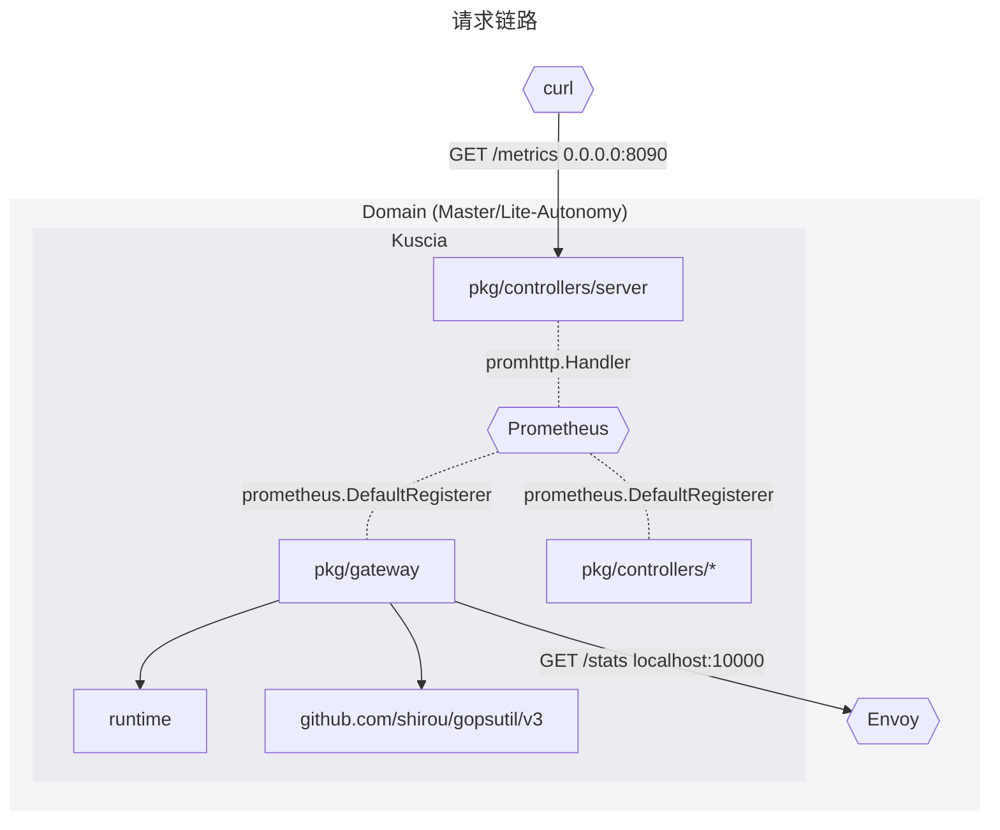
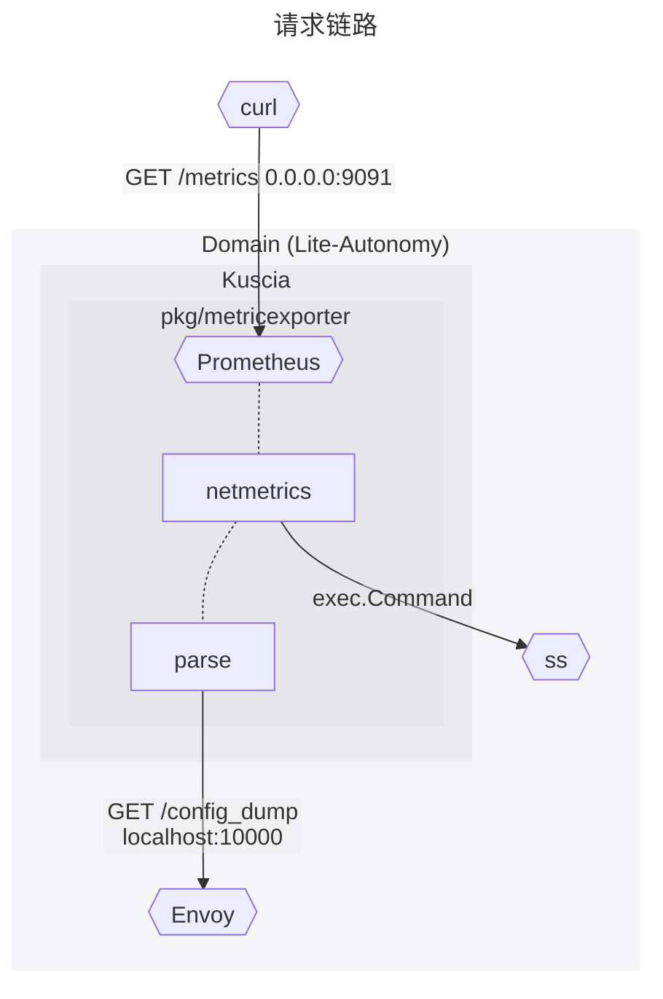
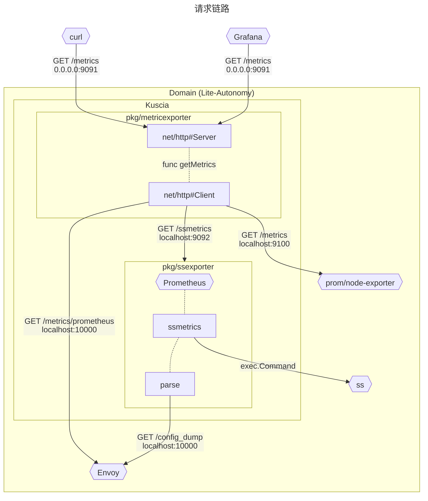

## 消歧义

为避免中文译名产生歧义，以下概念将完全使用英文表述：

- **Node** —— 特指 **Kubernetes** 的 [Node]
  - 在 Kubernetes 中的实体是 `kubectl get nodes`
- **Domain** —— 特指 Kuscia 的 [Domain]，即 Kuscia 网络中的一个独立的参与方
  - 在 Kubernetes 中的实体是 `kubectl get domains`
- **Lite-Autonomy** —— 特指 Kuscia 中使用 Lite 或是 Autonomy 运行模式的抽象的“隐私计算节点”，它们的显著特征是都会运行 agent 来进行计算任务的调度
  - 类比 Ray 的 [Worker Node][ray-worker-node]
- **Master-Autonomy** —— 特指 Kuscia 中使用 Master 运行模式的抽象的“隐私计算节点”，它们的显著特征是运行 [Kubernetes API Server][kube-apiserver]
  - 类比 Ray 的 [Head Node][ray-head-node]

[Domain]: https://www.secretflow.org.cn/zh-CN/docs/kuscia/v0.6.0b0/reference/concepts/domain_cn
[Node]: https://kubernetes.io/docs/concepts/architecture/nodes/
[ray-worker-node]: https://docs.ray.io/en/latest/cluster/key-concepts.html#worker-node
[kube-apiserver]: https://kubernetes.io/docs/concepts/overview/components/#kube-apiserver
[ray-head-node]: https://docs.ray.io/en/latest/cluster/key-concepts.html#head-node

## 现有实践

### `pkg/gateway/metrics`, `pkg/controllers/*/metrics`

From: secretflow/kuscia#1

Kuscia 初始版本中已经包含指标采集相关代码，指标由 Prometheus 经由 `http://localhost:{{HealthCheckPort}}/metrics` 透出。但这一功能并未在文档中记录。

- 在 `pkg/gateway` 中，
  - 采集 **gateway 所在机器的 CPU、内存及网络 I/O 指标**；
  - 采集 Envoy 的 `membership_total` 及 `membership_healthy` 指标（Envoy 集群统计），反映**成员 Domain 状态**；
- 在 `pkg/controllers/domain/metrics` 中，采集
  - `domain_worker_queue_size` **Domain 的 Controller 队列长度**
- 在 `pkg/controllers/kusciajob/metrics` 中，采集
  - `kuscia_job_worker_queue_size` **KusciaJob 的 Controller 队列长度**
  - `kuscia_job_sync_durations_seconds` **Job 时长分布**
  - `kuscia_job_result_stats` **Job 成功/失败数量**
- 在 `pkg/controllers/kusciatask/metrics`，采集
  - `kuscia_task_worker_queue_size` **KusciaTask 的 Controller 队列长度**
  - `kuscia_task_sync_durations_seconds` **Task 时长分布**
  - `kuscia_task_result_stats` **Task 成功/失败数量**
- 在 `pkg/controllers/taskresourcegroup/metrics` 中 —— _什么是 TaskResourceGroup?_
- 在 `pkg/controllers/server` 中，将 `promhttp.Handler` 注册到 `/metrics` 路由上。

  
初始化序列

  <ul>
    <li>cmd/kuscia/modules/domainroute#New
      <ul>
        <li>pkg/gateway/commands#Run
          <ul>
            <li>pkg/gateway/metrics#MonitorRuntimeMetrics</li>
            <li>pkg/gateway/metrics#MonitorClusterMetrics</li>
          </ul>
        </li>
      </ul>
    </li>
  </ul>

### `pkg/ssexporter`

From: secretflow/kuscia#52 secretflow/kuscia#125 @Vancasola

**What ——** secretflow/kuscia#125 实现了 `metricexporter`，通过 `ss` 采集并聚合 Domain 之间的网络质量指标。

**Where ——** Lite-Autonomy

在 secretflow/kuscia#125 中，

- 在 `pkg/metricexporter` 中
  - 调用 `ss` 获取 **gateway 所在机器的 socket 统计**，包括 TCP retransmissions，反映 Domain 之间的 **网络质量**；
  - 请求 Envoy admin ，然后解析集群配置，用来**聚合** `ss` 的统计数据；
  - 使用 Prometheus 经由 `http://0.0.0.0:9091/metrics` 透出。

  
初始化序列

  <ul>
    <li>cmd/kuscia/autonomy, cmd/kuscia/lite
      <ul>
        <li>cmd/kuscia/modules/metricexporter#RunMetricExporter
          <ul>
            <li>pkg/metricexporter#MetricExporter</li>
          </ul>
        </li>
      </ul>
    </li>
  </ul>

### `pkg/metricexporter`

From: secretflow/kuscia#220 secretflow/kuscia#224 @Vancasola

**What ——** secretflow/kuscia#224 在 secretflow/kuscia#125 基础上实现 Node 指标采集以及 Grafana demo。

**Where ——** 采集位于 Lite-Autonomy；Grafana 额外部署在集群外。

在 secretflow/kuscia#224 中，

- 原来的 `pkg/metricexporter` 变为 `pkg/ssexporter`，仍然负责 `ss` 的指标采集；
- 在 `pkg/metricexporter` 中
  - 请求 `node_exporter`，获取 **gateway 所在机器的硬件指标**，见 <https://github.com/prometheus/node_exporter>
  - 请求 Envoy admin，获取对每个 Envoy cluster（代表每个 Domain）**网络连接的统计指标**
  - 请求 `pkg/ssexporter`，获取来自 `ss` 的反映**通信质量的聚合指标**
  - 将 3 个来源的 HTTP 响应拼接后，从 `http://0.0.0.0:9091/metrics` 透出
    - 所有数据源的数据格式都是 Prometheus 格式
- Grafana 从 `http://0.0.0.0:9091/metrics` 获取数据

### 指标一览

- `envoy_.+` Envoy
  - `envoy_upstream_cx_.+` Envoy connections
  - `envoy_upstream_rq_.+` Envoy requests
- `net_conntrack_.+` [conntrack] via Prometheus
- `node_.+` Node exporter
- `ss_.+` socket stats

[conntrack]: https://blog.cloudflare.com/conntrack-tales-one-thousand-and-one-flows

## 通信机制

### Handshake

- `localhost:1054` Handshake cluster
- `localhost:80` Internal cluster
- `localhost:10001` xDS
